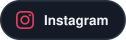

<picture>
  
</picture>

Senior Software Engineer from Lahore, Pakistan, with 4+ years across backend, frontend, and infrastructure. Currently on the core platform team at YieldWerx, modernizing a legacy yield management platform for the semiconductor industry.

---

### 📍 Career Timeline

Full role details on [LinkedIn](https://www.linkedin.com/in/rashidrra/).

---

### 🚀 Featured Projects

DocFlow is public — [github.com/rashidriaz/docflow](https://github.com/rashidriaz/docflow). Urma and Darzee are private client/in-progress repos, described above.

---

### 🧠 Technical Snapshot

---

### 🎓 Education

---

### 📈 Activity

<picture>
  <source media="(prefers-color-scheme: dark)" srcset="https://raw.githubusercontent.com/rashidriaz/rashidriaz/output/github-snake-dark.svg" />
  
</picture>

---

### 📬 Contact

